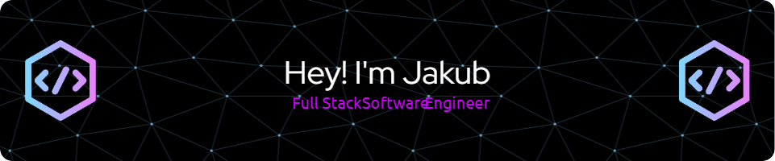

## Hi there 👋

- 🔭 I’m currently working on Gifinity - web application where you can store your favourite Gifs and Stickers
- 🌱 I’m currently learning NextJS
- 💬 Ask me about ...
- 📫 How to reach me: [My portfolio](https://jakubbabelek.com/), [LinkedIn](https://www.linkedin.com/in/jakub-babelek/)

## About me

Hi, I'm Jakub. Aspiring Full-Stack Software Engineer. Recently started a new coding adventure with the School of Code. Passionate about the Tech Industry and coding. Currently mastering NextJS and Typescript. Love to use my problem solving and organization skills to tackle coding challenges. If I'm not coding I'm probably on a bike trip.

**<h3 align="left">My tech stack</h3>**

	<code></code>
	<code></code>
	<code></code>
	<code></code>
	<code></code>
	<code></code>
	<code></code>
	<code></code>
	<code></code>
	<code></code>
	<code></code>

 **<h3 align="left">GitHub Stats</h3>**

  
  

